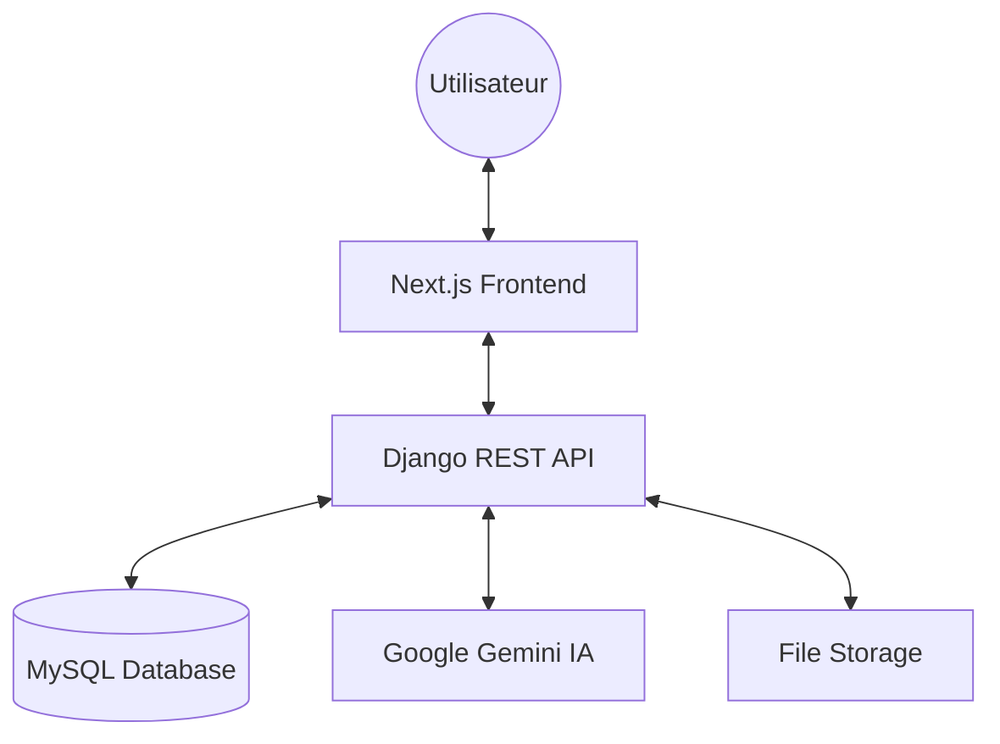

# 🧠 Quiz AI Platform


[](https://www.python.org/)
[](https://www.djangoproject.com/)
[](https://nextjs.org/)
[](https://www.docker.com/)
[](http://localhost:8000/api/docs/)

> **Une plateforme intelligente de génération et de gestion de quiz propulsée par l'IA.** Transformez vos notes en outils d'apprentissage interactifs en quelques secondes.

---

## ✨ Fonctionnalités Clés

- 🤖 **Génération par IA** : Utilisation de Google Gemini pour créer des questions pertinentes à partir de vos documents.
- 📂 **Gestion de Notes** : Importez vos fichiers (PDF, Word, Texte) et organisez vos connaissances.
- ⏱️ **Sessions Temps Réel** : Créez et rejoignez des sessions de quiz interactives.
- 📊 **Suivi des Progrès** : Visualisez vos scores et analysez vos points forts/faibles.
- 🌍 **Interface Moderne** : UI réactive et fluide construite avec Next.js et Tailwind CSS.
- 📖 **API Documentée** : Documentation complète via Swagger/OpenAPI.

---

## 🛠️ Stack Technique

### Backend (Architecture Robuste)
- **Framework** : Django REST Framework (DRF)
- **Base de données** : MySQL
- **IA/ML** : Google Generative AI (Gemini Pro)
- **Auth** : JWT (SimpleJWT)
- **Documentation** : drf-spectacular (Swagger/OpenAPI)

### Frontend (Expérience Utilisateur)
- **Framework** : Next.js (App Router / Pages)
- **Styling** : Tailwind CSS
- **State Management** : Hooks & Context API
- **I18n** : Internationalisation multilingue

---

## 🏗️ Architecture du Système



---

## 🚀 Installation & Démarrage

### 🐳 Avec Docker (Recommandé)

Le projet est entièrement dockerisé pour un déploiement rapide.

1. **Cloner le dépôt** :
   ```bash
   git clone https://github.com/votre-username/quiz_ai_platform.git
   cd quiz_ai_platform
   ```

2. **Configurer l'environnement** :
   Créez un fichier `.env` dans le dossier `backend/` en vous basant sur `.env.example`. Assurez-vous d'ajouter votre `GOOGLE_API_KEY`.

3. **Lancer les conteneurs** :
   ```bash
   docker-compose up --build
   ```

4. **Accès** :
   - Frontend : [http://localhost:3000](http://localhost:3000)
   - Backend API : [http://localhost:8000/api/](http://localhost:8000/api/)
   - **Documentation Swagger** : [http://localhost:8000/api/docs/](http://localhost:8000/api/docs/)

### 🐍 Installation Manuelle (Développement)

<details>
<summary>Voir les instructions détaillées</summary>

#### Backend
```bash
cd backend
python -m venv venv
source venv/bin/activate # ou venv\Scripts\activate sur Windows
pip install -r requirements.txt
python manage.py migrate
python manage.py runserver
```

#### Frontend
```bash
cd frontend
npm install
npm run dev
```
</details>

---

## 📚 Documentation API

L'API est entièrement documentée selon les standards OpenAPI. Une fois le serveur lancé, vous pouvez accéder à :

- **Swagger UI** : `http://localhost:8000/api/docs/` (Interactif)
- **Redoc** : `http://localhost:8000/api/redoc/` (Statique)

---
Ce projet a été conçu pour démontrer des compétences en architecture Full-stack, intégration d'IA et DevOps.
---

*Développé avec ❤️ pour l'innovation éducative.*
